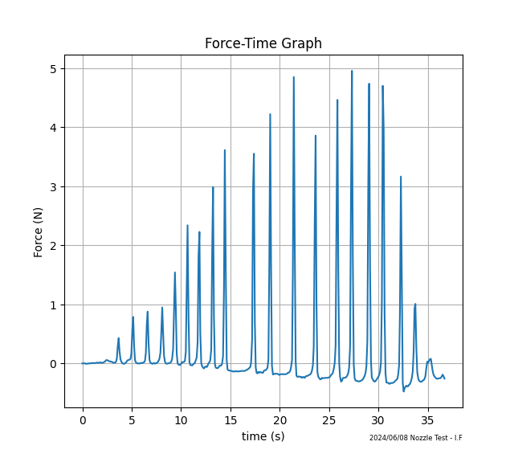

# I.F Rocket Project Code Repository

광주과학고등학교 로켓 동아리 I.F의 프로젝트 진행에 사용되는 코드들을 모아두는 레포입니다.

## 추력 테스트 장치

* [아두이도 업로드 코드](./test/test.ino)

test.ino는 추력 테스트 장치의 아두이노에 업로드하는 코드입니다. 사용하는 추력 테스트 장치는 로드셀과 아두이노를 연결하여 사용하는 중입니다. 

* [데이터 수집 코드](data.py)

data.py는 아두이노가 Serial 통신을 통해 보내주는 값을 저장하는 코드입니다. **아두이노 ide 시리얼 모니터가 켜져있으면 에러가 발생합니다** 코드가 작성중일 때 Ctrl+C를 눌러 정지시키면 값을 자동으로 data.csv에 저장합니다.

* [데이터 시각화 코드](visualize.py)

visualize.py는 저장된 값을 해석하는 코드입니다. 주석으로 Data Calibration Factor라고 되어있는 부분의 값을 수정하여 사용하면 됩니다. ```zero```는 로드셀 위에 아무것도 올려두지 않았을 때의 값, ```mass```는 로켓의 질량(Kg 단위), ```rocket```은 로켓만 로드셀 위에 올려두었을 때 값입니다.



위는 실제로 테스트에서 측정된 값을 해당 코드로 시각화한 모습입니다. 해당 실험에선, 설계 실수로 내부 압력을 챔버가 버티지 못해, 간헐적으로 분사되는 실험 결과를 보였습니다.